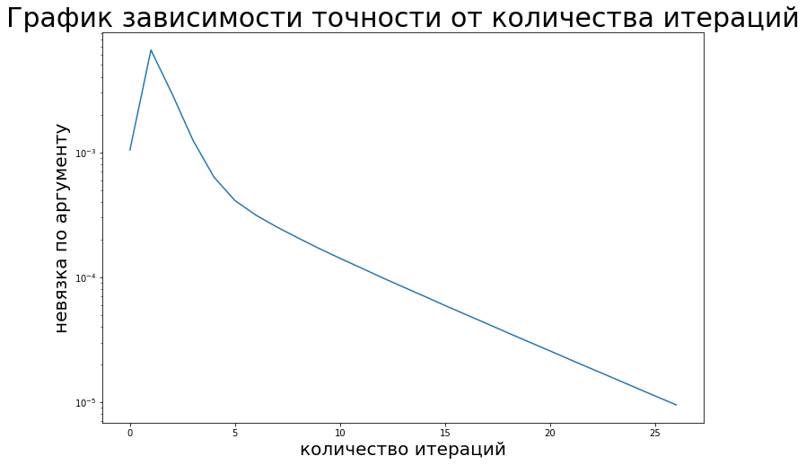
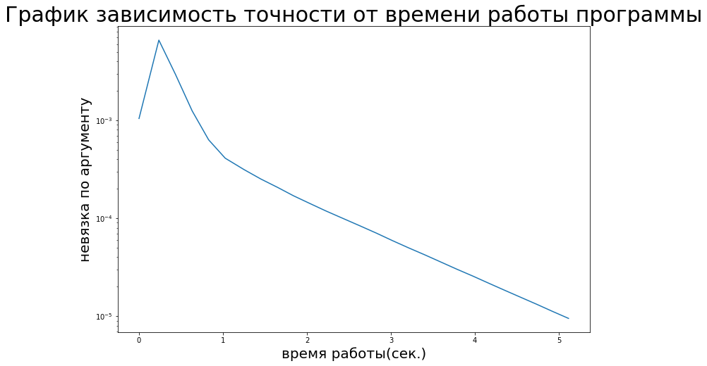
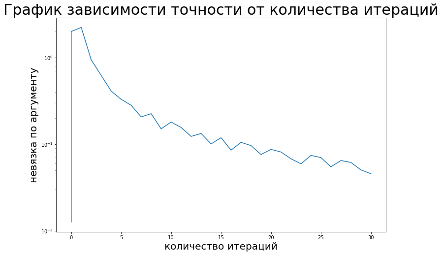
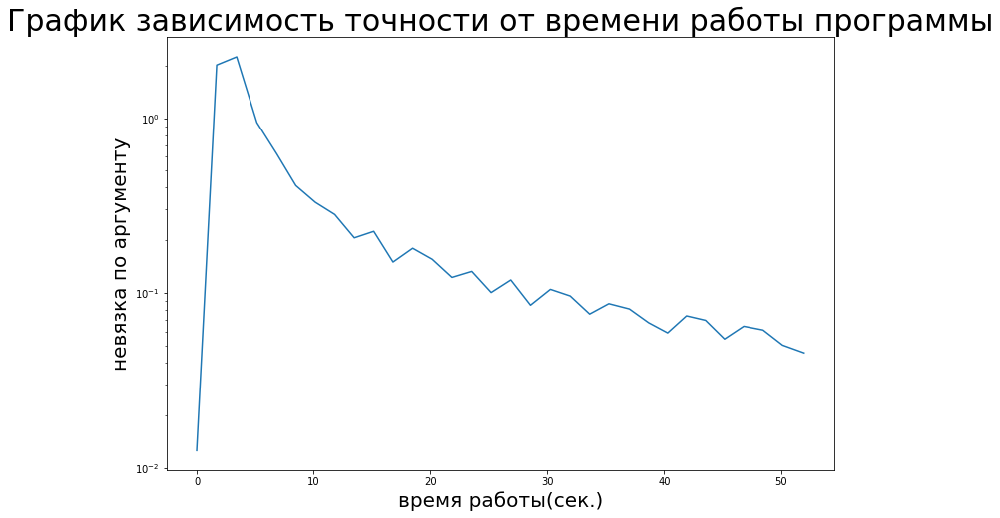
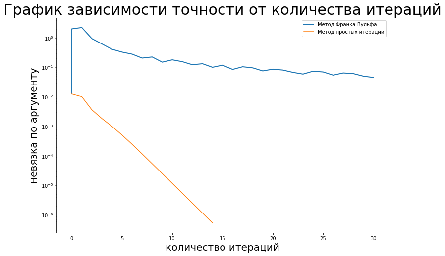
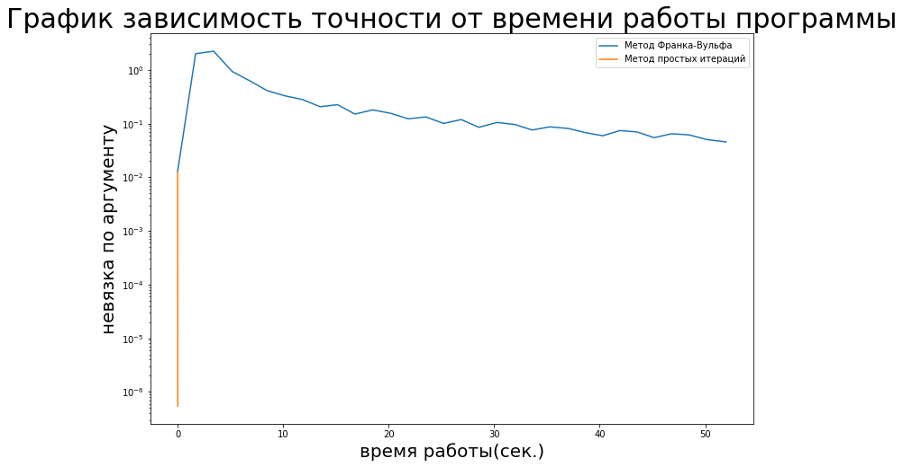

# PageRank
В данной работе предлагается рассмотреть алгоритм ранжирования web-страниц, а именно нахождение вектора PageRank. PageRank — это числовая величина, характеризующая «важность» веб-страницы. Чем больше ссылок на страницу, тем она «важнее». Первый способ ранжирования web-страниц был предложен Сергеем Брином и Ларри Пейджем в 1998 г. Этот метод лег в основу поисковой системы Google.

Рассмотрим ориентированный взвешанный граф. Пусть у графа   вершин.
Каждой паре вершин соответсвует некоторый вес(вероятность перехода)  . 
Числа   образуют переходную матрицу  . 
Отметим, что матрица P является стохаcтической по строкам. 

## Метод простых итераций

Для того чтобы перейти с одной web-старницы на другую, пользователь должен с определенной вероятностью выбрать, 
по какой именно ссылке перейти. В случае если у документа несколько исходящих ссылок, 
то будем считать, что пользователь переходит по каждой из них с одинаковой вероятностью. 
Ну и, наконец, есть еще коэффициент телепортации, который показывает нам, что с какой-то 
вероятностью пользователь может с текущего документа переместиться на другую страницу, 
не обязательно связанную напрямую со страницей, в которой мы находимся в данный момент. 
Пусть пользователь телепортируется с вероятностью  . Тогда, если ввести квадратную матрицу  , 
размера   на  , 
состоящую из одинаковых элементов  . Тогда уравнение, описывающее данный метод, имеет вид:

 

Но матрица   является разреженной матрицей - матрица с преимущественно нулевыми элементами. Для работы
с ражреженными матрицами в Python используется библиотека sparse, которая помогает матрице  
занимать гораздо меньше памяти.

Результаты работы этого алгоритма на данных http://snap.stanford.edu/data/web-Google.html представлены на графиках:

## Метод условного градиента

Вектор PageRank также можно понимать, как решение следующей задачи:

 

Для решения этой задачи будем использовался метод условного градиента Франка–Вульфа. Работа метода Франка-Вульфа на следующих данных : http://snap.stanford.edu/data/p2p-Gnutella08.html:

Сравнение с МПИ:

## Метод Монте-Карло

Данный метод основан на физическом смысле эргодической ОДМЦ. Мы запускаем виртуального пользователя, который блуждает по страницам сайтам. Собирая статистику посещения им страниц сайта, спустя достаточно большой промежуток времени мы получаем для каждой страницы, сколько раз на ней был пользователь. Нормируя этот вектор, мы получаем искомый вектор PageRank.

